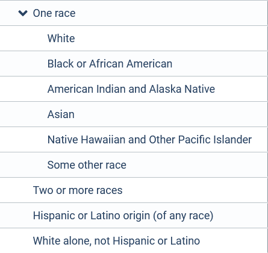

```{r setup, include=FALSE}
knitr::opts_chunk$set(echo = TRUE)
library(tidyverse)
library(tidycensus)
```

# Data
Data on demographic characteristics is available from the American Community Survey. Load 2018 ACS 5-year data. Table `S0802` contains summary data on commuting to work by selected characteristics. To get data for the City of Madison, we need to choose "place" as the geography.

```{r message=F}
commute <- get_acs(geography = "place", state = 55, table = "S0802")
```
Filter the data to Madison only and add variable labels.
```{r}
v <- load_variables(dataset = "acs5/subject", year = 2018, cache = T)

madison <- commute %>% 
  filter(NAME == "Madison city, Wisconsin") %>% 
  left_join(v, by = c("variable" = "name"))

```
The data labels are still very long and don't lend themselves to easy summaries. We will fix this:
```{r}
madison <- madison %>% 
  mutate(mode = case_when(str_detect(variable, "S0802_C02") ~ "Drive Alone",
                          str_detect(variable, "S0802_C03") ~ "Carpool",
                          str_detect(variable, "S0802_C04") ~ "Transit",
                          str_detect(variable, "S0802_C01") ~"Total"),
                          )

```

Test one graph:
```{r}
madison %>% 
  filter(str_detect(label, "White alone")) %>% 
  filter(mode != "Total") %>% 
  ggplot(aes(x = mode, y = estimate)) +
  geom_col()
```
This shows that the data provides percentages _within_ each mode, not within each demographic group. That is, of all people who carpool, about 68% are white; of all people who drive alone, about 80% are white, etc. A stacked bar chart by race should help with this. First I need to create a race/ethnicity variable.

This is a tricky endeavor as race and ethnicity are not exclusive categories and also aggregated. The ACS summary table reports the following categories:



Let's start by consolidating into non-Hispanic White, Hispanic/LatinX, Black, and Asian. Again, these won't be mutually exclusive and won't add up to 100%.

```{r}
madison <- madison %>% 
  mutate(race_ethn = case_when(str_detect(label, "White alone") ~ "non-Hispanic White",
                          str_detect(label, "Black") ~ "Black",
                          str_detect(label, "Asian") ~"Asian",
                          str_detect(label, "!!Hispanic") ~ "Hispanic/Latinx"))
```

Graph again, grouped by mode.
```{r}
madison %>% 
  filter(!is.na(race_ethn)) %>% 
  filter(mode != "Total") %>% 
  #group_by(mode) %>% 
  ggplot(aes(x = mode, y = estimate, fill = race_ethn)) +
  geom_col(position = "dodge")
  
```

This is somewhat easier to read. But because both the modes and the demographic groups have such large differences within and between, it's still tricky. For example, you can see that non-Hispanic White is the dominant category in all three modes -- well, because they're the largest demographic group overall. 

Because overall these three modes make up such different mode shares, it would be nice to compare the modes within the demographic groups rather than between them. Unfortunately this requires some complicated wrangling of the data (If someone is aware of an easier way, please let me know!).

## Example: Gender
I used gender as easy starting point because it has only two, mutually exclusive categories and the absolute mode share numbers by gender are also reported in table `B08006`, which is a useful check to make sure I got this right.

First, let's write a short function that extracts the estimate for a provided variable

```{r}
get_estimate <- function(v){
  madison %>% 
    filter(variable == v) %>% 
    select(estimate)
}
```


```{r}
total <- get_estimate("S0802_C01_001")
```

So the universe for table `S2701` is "Workers, 16 years and over," and Madison has `r total` of those.

```{r}
pct_male <- get_estimate("S0802_C01_009")
total_male <- total * pct_male/100

pct_female <- get_estimate("S0802_C01_010")
total_female <- total *pct_female/100
  
```

Out of those `r total`, `r total_male` (`r pct_male`%) are male; `r total_female` (`r pct_female`%) are female.

```{r}
total_drv_aln <- get_estimate("S0802_C02_001")

total_carpool <- get_estimate("S0802_C03_001")

total_transit <- get_estimate("S0802_C04_001")

pct_drv_aln_male <- get_estimate("S0802_C02_009")

pct_drv_aln_female <- get_estimate("S0802_C02_010")

pct_carpool_male <- get_estimate("S0802_C03_009")

pct_carpool_female <- get_estimate("S0802_C03_010")

pct_transit_male <- get_estimate("S0802_C04_009")

pct_transit_female <- get_estimate("S0802_C04_010")

pct_male_drv_alone <- total_drv_aln * pct_drv_aln_male/100/total_male

pct_female_drv_alone <- total_drv_aln * pct_drv_aln_female/100/total_female

pct_male_carpool <- total_carpool * pct_carpool_male/100/total_male

pct_female_carpool <- total_carpool * pct_carpool_female/100/total_female

pct_male_transit <- total_transit * pct_transit_male/100/total_male

pct_female_transit <- total_transit * pct_transit_female/100/total_female

gender_mode_share <- tibble(gender = rep(c("male", "female"), each = 3),
       mode = rep(c("drive alone","carpool", "transit"), times = 2),
       share = c(pct_male_drv_alone[[1]], 
                 pct_male_carpool[[1]], 
                 pct_male_transit[[1]],
                 pct_female_drv_alone[[1]],
                 pct_female_carpool[[1]],
                 pct_female_transit[[1]]))

gender_mode_share %>% 
  ggplot(aes(mode, share, fill = gender)) +
  geom_col(position = "dodge")
```

  

  
```{r}
madison %>% 
  pivot_wider(names_from = label, values_from = estimate, names_sep = "!!")

who
```

